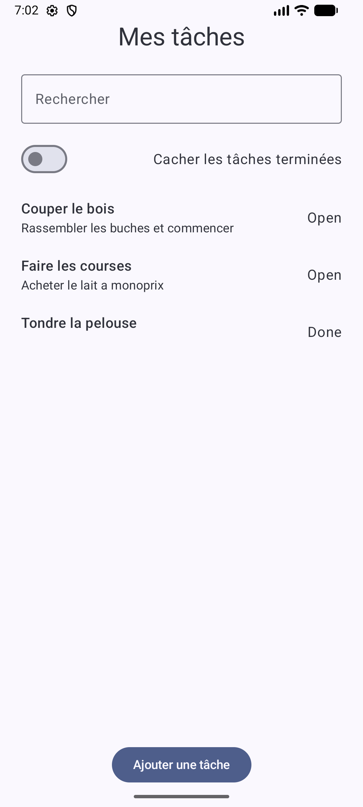
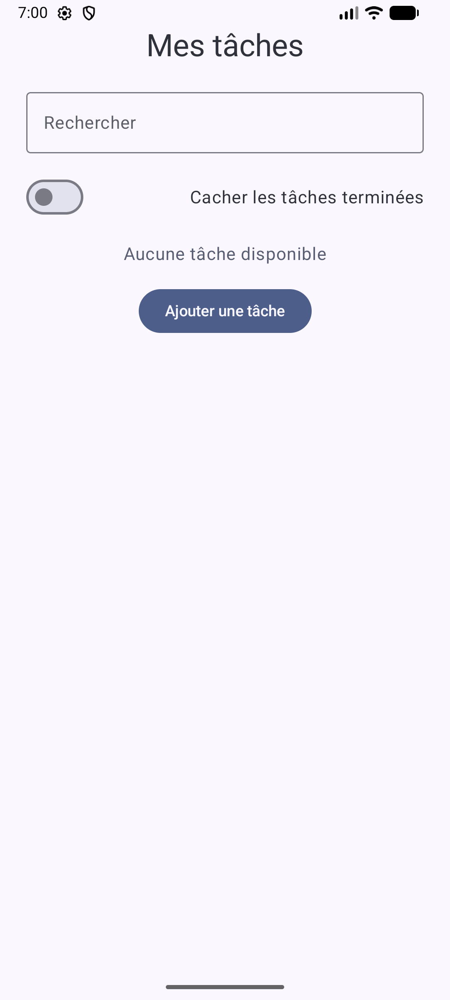
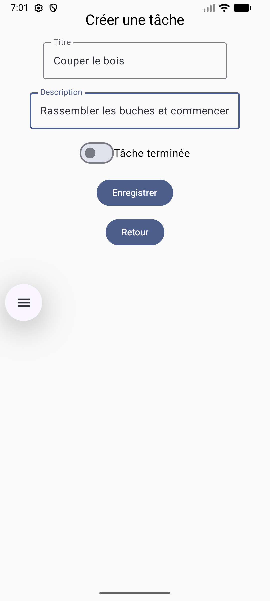

# CheckList

Application Android de gestion de tâches développée en **Kotlin** avec une architecture moderne basée sur **Jetpack Compose**, **ViewModel**, **StateFlow**, **Room**, **DataStore** et **Hilt**.

Le projet propose une expérience simple de gestion de tâches avec persistance locale, recherche, filtrage et gestion claire des états d’interface.

---

## Screenshots

  
  
  

---

## Fonctionnalités

- affichage d’une liste de tâches
- ajout de tâche
- modification d’une tâche existante
- recherche par titre
- filtre des tâches terminées
- persistance locale des données avec Room
- sauvegarde d’une préférence utilisateur avec DataStore
- gestion des états UI : chargement, erreur, vide, contenu
- tests unitaires sur la logique de présentation
- tests UI Compose sur les principaux états d’écran

---

## Stack technique

- **Kotlin**
- **Jetpack Compose**
- **Material 3**
- **ViewModel**
- **StateFlow / SharedFlow**
- **Room**
- **DataStore**
- **Hilt**
- **Navigation Compose**
- **JUnit**
- **Compose UI Test**

---

## Architecture

L’application suit une architecture en couches avec séparation des responsabilités :

- **UI**
    - écrans et composants Compose
    - rendu piloté par un `UiState`
- **Presentation**
    - `ViewModel`
    - logique d’affichage et transformations d’état
- **Data**
    - repositories
    - accès base locale et préférences utilisateur
- **Domain**
    - modèles métiers

### Flux de données

`Room / DataStore -> Repository -> ViewModel -> StateFlow -> UI Compose`

---

## Écran principal

L’écran principal permet de :

- consulter les tâches enregistrées
- rechercher une tâche par son titre
- masquer les tâches terminées
- accéder à l’ajout d’une nouvelle tâche
- ouvrir une tâche existante pour consultation ou modification

---

## Gestion des états UI

L’écran de liste gère explicitement plusieurs états :

- **loading**
- **error**
- **empty**
- **content**

Ces états sont centralisés dans `TasksUiState`, ce qui permet un rendu prévisible, testable et facile à faire évoluer.

---

## Tests

### Tests unitaires

Les tests unitaires couvrent notamment :

- le chargement des tâches dans le `ViewModel`
- le filtrage des tâches terminées
- le filtrage par recherche

### Tests UI Compose

Les tests UI vérifient notamment :

- l’affichage des tâches
- l’affichage de l’état d’erreur
- l’affichage de l’état vide

---

## Structure technique

Exemples de responsabilités présentes dans le projet :

- `TasksViewModel` : orchestration de l’état de l’écran principal
- `TasksRepository` : accès et transformation des données
- `UserPreferencesRepository` : gestion des préférences utilisateur
- `TasksContent` : affichage des différents états de l’écran
- `TaskRow` : composant de ligne de tâche réutilisable

---

## Pistes d’amélioration

- ajout d’une action de retry sur l’état d’erreur
- amélioration de l’accessibilité
- adaptation tablette / grand écran
- extension de la couverture de tests
- raffinement visuel de l’interface

---

## Lancer le projet

1. cloner le repository
2. ouvrir le projet dans Android Studio
3. synchroniser Gradle
4. lancer l’application sur un émulateur ou un appareil Android
